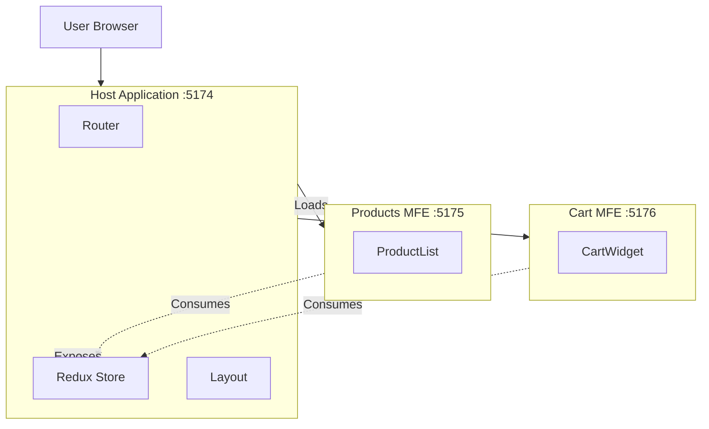

# Micro-Frontend E-Commerce Application

A modern, scalable e-commerce application built using **Micro-Frontend Architecture** with **React**, **Vite**, and **Module Federation**.

This project demonstrates how to split a monolithic application into smaller, independently deployable Micro-Frontends (MFEs) that share state and resources seamlessly.

## 🏗️ Architecture

The application is composed of three distinct applications:

1.  **Host App**: The container application that orchestrates the layout and loads remote modules. It also manages the global state (Redux Store) and provides it to other MFEs.
2.  **Products App**: A remote MFE responsible for fetching and displaying the product catalog.
3.  **Cart App**: A remote MFE that manages the shopping cart functionality.



## 🚀 Key Concepts

### Module Federation

This project utilizes the **Vite Plugin for Module Federation** to allow separate builds to form a single application at runtime.

- **Bi-Directional Sharing**: The `Host` exposes the Redux Store, while `Products` and `Cart` expose their respective UI components.
- **Shared Dependencies**: libraries like `react` and `react-dom` are shared as singletons to prevent multiple instances and reduce bundle size.

### Distributed State Management

The **Redux Store** is initialized in the `Host` application and exposed to remote applications. This allows the `Products` app to add items to the cart, and the `Cart` app to display them, all updating the same global state source.

## 🛠️ Tech Stack

- **Core**: [React 19](https://react.dev/), [Vite](https://vitejs.dev/)
- **Architecture**: [Module Federation](https://module-federation.io/)
- **State Management**: [Redux Toolkit](https://redux-toolkit.js.org/)
- **Routing**: [React Router DOM](https://reactrouter.com/)
- **Styling**: CSS / Styled Components (project dependent)

## 📦 Project Structure

```bash
micro-frontend/
├── host/           # Main Container App (Port 5174)
├── products/       # Products Micro-Frontend (Port 5175)
└── cart/           # Cart Micro-Frontend (Port 5176)
```

## 🏁 Getting Started

To run this project locally, you need to start each application independently (or use a concurrent runner if configured).

### Prerequisites

- Node.js (v16+ recommended)
- npm or yarn

### Installation & Running

You need to run the following commands for **each** directory (`host`, `products`, `cart`).

1.  **Host App**

    ```bash
    cd host
    npm install
    npm run dev
    # Running on http://localhost:5174
    ```

2.  **Products App** (Open a new terminal)

    ```bash
    cd products
    npm install
    npm run dev
    # Running on http://localhost:5175
    ```

3.  **Cart App** (Open a new terminal)
    ```bash
    cd cart
    npm install
    npm run dev
    # Running on http://localhost:5176
    ```

Once all servers are running, navigate to `http://localhost:5174` to view the integrated application.

## 🤝 Contributing

1.  Fork the repository
2.  Create your feature branch (`git checkout -b feature/AmazingFeature`)
3.  Commit your changes (`git commit -m 'Add some AmazingFeature'`)
4.  Push to the branch (`git push origin feature/AmazingFeature`)
5.  Open a Pull Request
